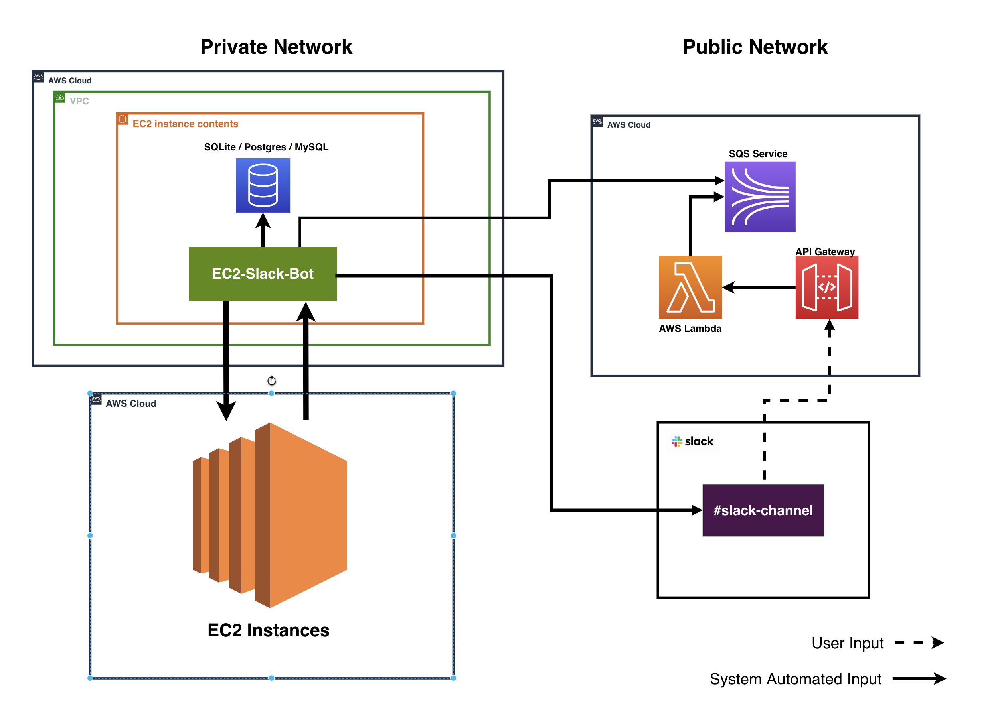
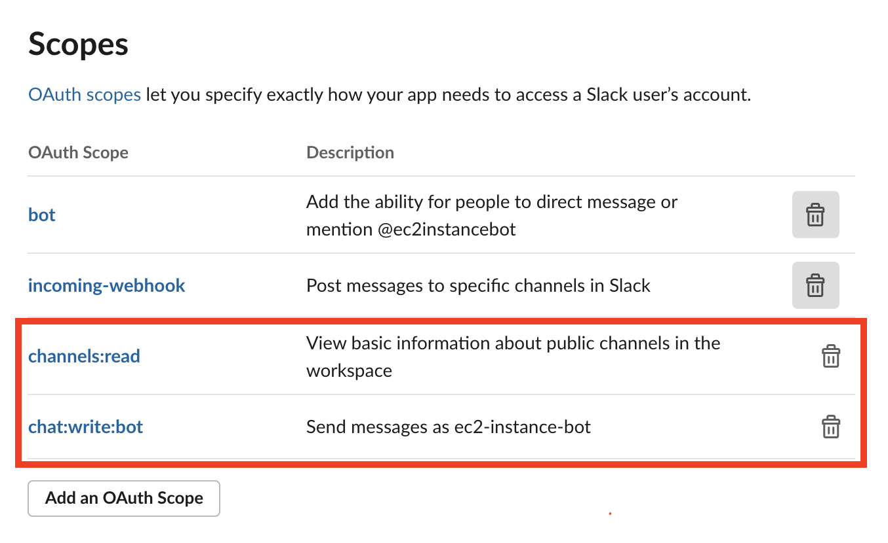
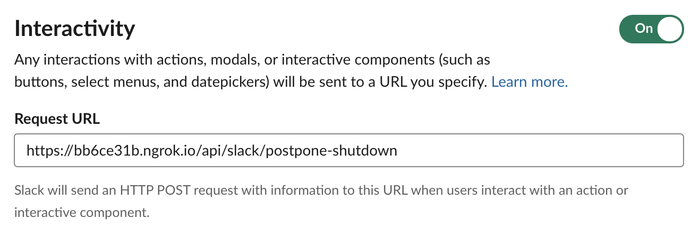
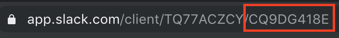

# Slack Chatbot to monitor EC2

## Architecture


## <strong>Pre-requisite steps:</strong>

<strong>1. Create app in Slack's User interface</strong>

<strong>2. Add scopes in the "OAuth and Permissions" pane</strong>


<strong>3. Add request URL (your API endpoint which handles the Slack interactive message)</strong>


<strong>4. Adding the Slack channel ID (`SLACK_CHANNEL_ID` in `settings.js`):</strong>


<strong>5. Copy your app's OAuth token into `SLACK_TOKEN` in `settings.js`</strong>

<strong>6. Set logging directory in `LOG_DIR` in `settings.js`</strong>

<strong>7. Add database credentials, and run the app</strong>

<strong>8. Run `node app.js`</strong>

# Docker

## Building the image
```bash
docker build -t ec2-instance-bot:<tag> .
```

## Running container
```bash
docker run -d \
    -p 6666:3000 \
    -v /****/.aws:/root/.aws \
    -v /****/ec2_slack_bot/logs:/root/ec2bot_files/logs \
    -v /****/ec2_slack_bot/sqlite3:/root/ec2bot_files/sqlite3 \
    ec2-instance-bot:<tag>
```
